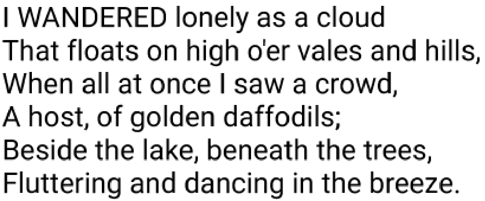

# Portable Type Engine v2.00

Release v2.00 23 March 2025

Please visit the main project's home page here: 
    [GitHub](https://github.com/matt123p/portable-type-engine)

Please the LICENSE file for details of licensing.


## Overview

This project is a font rendering engine written in pure C for low-to-moderate
resolution displays, such as typical 480p or 720p LCD panels, coupled with a
lower-power CPU such as an ESP32 or a small ARM processor.

**Portable Type Engine works as a standalone add-on for LVGL 9.4 and newer.**
It provides runtime-scalable `lv_font_t` fonts without modifying or patching
LVGL, and supports the Arduino IDE, PlatformIO, and CMake. One compact generated
font can be rendered at multiple sizes or resized while the application runs.
See the [LVGL add-on guide](docs/lvgl.md), the [ESPHome and LVGL
guide](docs/esphome.md), and the [examples](examples/README.md).


- **High-quality embedded display output:** designed for greyscale and color
  displays, with anti-aliasing that improves readability, particularly at small
  text sizes.

- **Runtime font scaling:** render one compact font definition at many sizes
  instead of storing a separate font copy for every size.

- **Fast rendering without a persistent glyph cache:** text is rasterized on
  demand without the large RAM cache commonly used by scalable font engines.

- **Extremely low RAM footprint:** font data remains in compact, read-only
  storage, with typical engine working memory around 0.5 KiB for the bundled
  Roboto font. See [RAM usage](#ram-usage) for the full breakdown and comparison.

### ESPHome

PTE includes an ESPHome external component that exposes runtime-scalable fonts
as ordinary IDs accepted by LVGL's `text_font` option. It bundles regular,
bold, italic, and bold-italic Roboto plus Material Icons, so the normal setup is
YAML-only:

```yaml
external_components:
  - source:
      type: git
      url: https://github.com/matt123p/portable-type-engine.git
      ref: main
      path: src/esphome
    components: [pte_font]

pte_font:
  - id: ui_font
    font: roboto_regular

lvgl:
  widgets:
    - label:
        text: "PTE at 24 pixels"
        text_font: ui_font_24
```

One `pte_font` entry automatically creates suffixed IDs from size 6 through
75% of the generated font's sample size. The bundled 128-pixel fonts therefore
provide `ui_font_6` through `ui_font_96`.

Python, Pillow, FontTools, and local TTF/OTF files are required only when
building a custom font; they are not needed for the bundled fonts. See the
[ESPHome and LVGL guide](docs/esphome.md) for configuration, bundled font names,
and optional custom-font generation.

## Features

It has the following features:

1. Standalone LVGL 9.4+ integration with no changes required to LVGL itself
2. Extremely low RAM footprint, suitable for memory-constrained embedded systems
3. Very small compact C code, with a single dependency of stdlib
4. Can render the font at any size at run time from a single font definition
5. High quality font output - Characters are rendered to sub-pixel placement and with full anti-aliasing
6. A simple python tool is included to convert any TrueType or OpenType font to a C for inclusion in your project
7. Compact font definitions, each font is compressed using run-length encoding.
8. Unicode glyph tables with UTF-8 text input.

### RAM usage

PTE preprocesses TTF and OTF files on a development machine. The embedded
device therefore does not need a TrueType parser, outline data structures, or a
persistent rendered-glyph cache. The generated glyph, kerning, and compressed
bitmap arrays are declared `const`, so embedded toolchains can keep them in
flash/ROM rather than copying them into RAM.

For the standalone renderer, each generated font has a 36-byte base descriptor
on a typical 32-bit target, and each active size uses a 20-byte `pte_font`
handle (24 bytes on a typical 64-bit target). While a glyph is being rendered,
PTE allocates one scanline accumulator whose approximate size is:

```text
4 * (encoded glyph width + sub-pixel correction + 1) bytes
```

This allocation is released immediately after the scanline is rendered. For
the bundled Roboto font, encoded at 128 pixels, the widest glyph is 118 pixels;
the accumulator is therefore about 0.5 KiB. There is no allocation proportional
to the number of characters in the font or the amount of text already drawn.
Allocator bookkeeping and application/display buffers are not included in
these figures.

When used with LVGL, PTE also has one `lv_font_t` and a small adapter descriptor
per active size. LVGL supplies an A8 output buffer for the current glyph, which
is approximately `rendered width * rendered height` bytes plus stride and draw
buffer metadata. That glyph buffer is part of LVGL's rendering pipeline rather
than a persistent PTE cache.

#### Compared with Tiny TTF and similar engines

LVGL's Tiny TTF parses the original TTF at runtime and maintains glyph-metric,
rendered-bitmap, and kerning caches. For example, LVGL 9.6 defaults to 128 glyph
entries and 256 kerning entries; defaults can differ between LVGL versions.
Every cached A8 glyph additionally consumes roughly `width * height` bytes. The
exact total depends on font size, characters used, allocator overhead, and cache
configuration, but it can grow to tens of kilobytes as rendered glyphs fill the
cache.

Tiny TTF can reduce its glyph cache with the `_ex` creation functions, including
setting the glyph cache size to zero, and it can stream a font from a filesystem
when file support is enabled. Those options trade retained RAM for more runtime
parsing and rasterization work. FreeType and other runtime scalable-font engines
make similar trade-offs and vary considerably with their selected modules and
cache settings.

PTE instead pays the conversion cost before deployment and keeps runtime memory
bounded by the current glyph. This makes it a strong fit when predictable,
often sub-kilobyte engine working memory matters more than loading arbitrary
font files at runtime.

### Full anti-aliasing

Glyph coverage is blended into the destination pixels to produce smooth edges
and readable text, particularly at small sizes on lower-resolution displays.



### Sub-pixel placement

Glyphs are positioned using fractional pixel coordinates rather than being
forced onto whole-pixel boundaries. Anti-aliasing distributes each glyph's
coverage across the neighbouring pixels to compensate for that fractional
position. This preserves the font's exact advances, kerning, and intended text
spacing even when a character does not begin on a pixel boundary.


## Use

How to use:

1. Convert a font file to a C file (or use `examples/fonts/roboto_regular.c`)
2. Include the font file and the rendering engine (`src/pte/pte.c`) in your project
3. Implement the [`hw_blendPixel`](src/pte/README.md#hardware-callback) callback used by the engine to draw each pixel.
4. Call `pte_drawText()`, `pte_drawTextRect()` or `pte_measureText()` to render text on to your display.


Example usage

``` C
pte_font f = pte_getFont(get_Roboto_Regular(), 40);
y = f.m_baseline;
pte_drawText(&f, 5, y, 0, "Example text", -1, 0);
y += f.m_line_height;
```

## Documentation

- [C API reference](src/pte/README.md)
- [Font conversion tool guide](src/font-tool/README.md)
- [LVGL add-on guide](docs/lvgl.md)
- [ESPHome and LVGL guide](docs/esphome.md)

## LVGL 9 add-on

This repository is also an Arduino and PlatformIO library. Add it alongside
LVGL, include `lv_pte.h`, and create an LVGL font directly from any font emitted
by the converter:

```c
#include <lv_pte.h>

pte_base_font * get_Roboto_Regular(void);

lv_font_t * font = lv_pte_create(get_Roboto_Regular(), 24);
lv_obj_set_style_text_font(label, font, 0);
```

No LVGL source changes or `lv_conf.h` option are required. See the add-on guide
for PlatformIO and Arduino installation, resizing, lifetime, and testing.
