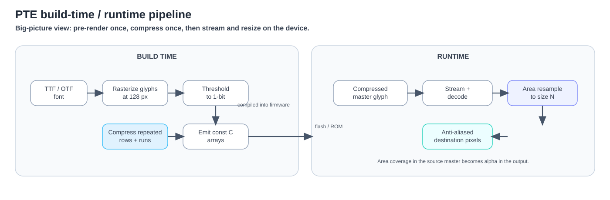
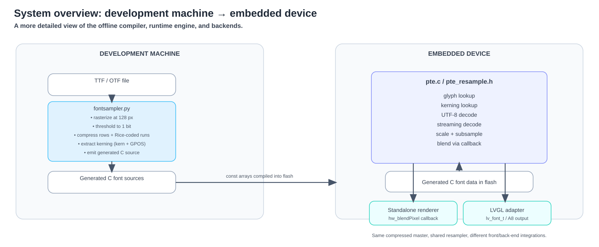
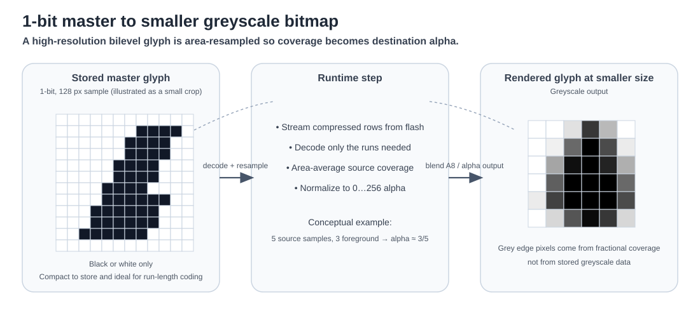
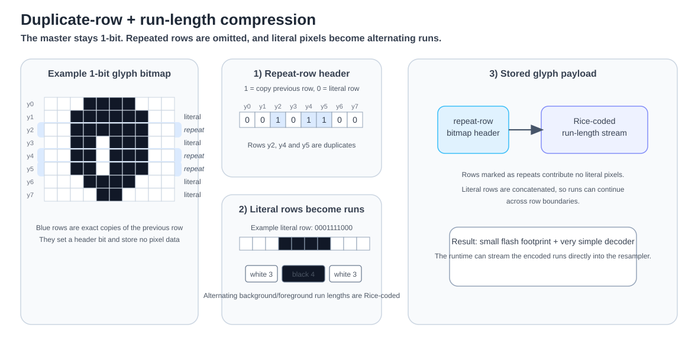
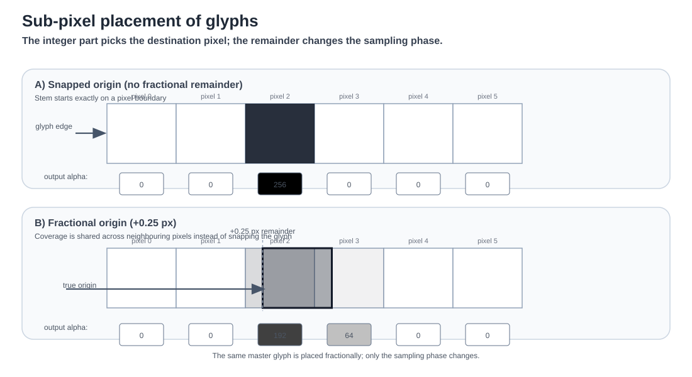

# Portable Type Engine — Architecture

Portable Type Engine (PTE) is a **runtime-scalable bitmap font engine for embedded systems**.

Its central idea is simple:

> **Render each glyph once at high resolution, store that bitmap in a compact form, then resize it when the text is drawn.**

Instead of storing many bitmap versions of the same font, PTE stores one high-resolution **1-bit master** for each glyph. These masters are compressed using repeated-row detection and run-length encoding. At runtime, the compressed glyph is streamed directly into an area resampler, which produces a smaller greyscale bitmap with smooth anti-aliased edges.

This gives PTE a useful balance for memory-constrained devices:

- one stored font can serve many output sizes;
- expensive font processing happens before deployment;
- font data remains compact in non-volatile storage;
- there is no persistent cache of resized glyphs;
- anti-aliasing is generated during scaling rather than stored explicitly.



---

## 1. The basic model

PTE separates font handling into two stages.

### 1.1 Before deployment

The original outline font is rasterized at a large sample size, typically 128 pixels high. The resulting greyscale image is converted to a 1-bit bitmap and compressed.

The stored font therefore contains **pixel geometry**, not curves or outline instructions.

### 1.2 At runtime

When text is drawn, the requested glyph is read from the compressed master and resized to the required output size.

The important detail is that PTE does not first reconstruct the whole high-resolution bitmap. **Decompression and resizing happen together as one streaming operation.**



This avoids keeping a large temporary image in memory and keeps the runtime process small and predictable.

---

## 2. Why use a high-resolution 1-bit master?

A conventional bitmap font normally stores one bitmap for every size that may be displayed. That is efficient at runtime, but storage grows quickly as more sizes are added.

PTE instead stores a single large master and derives smaller versions from it.

The master is deliberately **1-bit** rather than greyscale. Each source pixel is simply foreground or background. This has two advantages:

1. it reduces the amount of data that must be stored;
2. it produces long same-colour runs, which compress well.

The apparent loss of greyscale information is recovered during resizing. A destination pixel becomes grey when it covers a mixture of foreground and background source pixels.



The high-resolution master therefore contains the spatial detail needed for smooth smaller output even though the stored pixels themselves are only black or white.

---

## 3. Compression

The bitmap format is designed around the structure of glyphs. Text shapes contain large areas of background, solid strokes, and many neighbouring rows that are identical or nearly identical.

PTE exploits that structure in two stages.

### 3.1 Duplicate-row compression

If a row is identical to the row immediately above it, the second row does not need to be stored again. The compressed glyph only records that the row should be repeated.

This is especially effective on straight stems, horizontal sections, and large solid areas.

### 3.2 Run-length compression

Rows that are not duplicates are represented as alternating runs of background and foreground pixels.

For example:

```text
0001111000
```

becomes conceptually:

```text
3 background, 4 foreground, 3 background
```

The run lengths are then stored in a compact variable-length form. Short runs take little space, while longer runs require only slightly more.



The compression method is intentionally simple. Its purpose is not only to reduce storage, but also to make it possible to decode the font cheaply while it is being resized.

---

## 4. Streaming decompression

The compressed glyph is consumed progressively rather than expanded into a complete bitmap.

The runtime renderer reads one run at a time and passes that information directly into the resampling process.

This means a long background run can be skipped in one step, while a foreground run contributes coverage only to the destination pixels it overlaps.

Repeated rows are handled similarly: the renderer can reuse the previous row's contribution rather than process identical pixels again.

The key architectural property is therefore:

> **The full high-resolution glyph never needs to exist in working memory.**

Only the small amount of state required to build the current destination row is needed.

---

## 5. Resampling and anti-aliasing

PTE produces smooth edges using **area resampling**.

Each destination pixel represents a rectangular region of the high-resolution master. The renderer measures what fraction of that region is foreground.

Conceptually:

- 100% foreground → fully opaque pixel;
- 0% foreground → transparent pixel;
- 50% foreground → half-opacity grey edge pixel.

If one destination pixel covers five source samples and three are foreground, its coverage is approximately 3/5.

This is the sole source of anti-aliasing. The font does not need to store greyscale edge pixels because the greyscale values are recreated from geometry during resizing.

The process is separable: horizontal and vertical coverage are accumulated independently, allowing the renderer to work incrementally rather than on the whole glyph at once.

---

## 6. Sub-pixel glyph placement

Text spacing rarely maps perfectly onto whole display pixels. Scaling, kerning, and glyph advances often place a glyph at a fractional position.

PTE preserves that fractional position instead of rounding each glyph to the nearest pixel.

The whole-number part determines the approximate destination position. The fractional remainder changes the **sampling phase**.

As a result, a vertical stem placed one quarter of a pixel to the right does not simply jump to the next pixel. Its coverage is shared between neighbouring pixels in the correct proportion.



This preserves the intended spacing of the typeface and avoids the uneven rhythm that can appear when every glyph is independently snapped to the pixel grid.

---

## 7. Kerning and text spacing

Kerning information is prepared together with the font so that the relationships between pairs of glyphs are preserved at runtime.

The spacing adjustment for each pair is stored relative to the high-resolution master and then scaled with the requested font size.

Because glyph advances and kerning retain fractional precision, the layout remains consistent with the source typeface even though the final output is a raster image.

Kerning data is also deduplicated so that identical spacing patterns can share the same stored representation.

---

## 8. Memory model

The architecture is designed so that font size has much more impact on **non-volatile storage** than on working memory.

### Stored data

The font contains:

- glyph dimensions and spacing;
- compressed 1-bit glyph masters;
- kerning information;
- overall font metrics.

For the bundled Roboto Regular example, a 128-pixel master containing 199 glyphs occupies roughly **33 KB** in total.

### Runtime working memory

The renderer does not keep a cache of resized glyphs. Its temporary memory is mainly the set of horizontal coverage accumulators needed for the current glyph row.

For the bundled font this is roughly **half a kilobyte**.

The amount of working memory is therefore related to the width of the glyph being rendered, not to the number of glyphs in the font or the length of the string.

---

## 9. Design trade-offs

PTE deliberately favours predictable memory use over minimum rendering work.

### Advantages

- A single master font supports many smaller sizes.
- Working memory remains very small.
- Font data is compact and well suited to read-only storage.
- No outline parser is required at runtime.
- No persistent glyph bitmap cache is required.
- Anti-aliasing quality is derived consistently from the same source master.

### Costs

- Rendering a glyph requires resampling each time it is drawn.
- The stored master is larger than a bitmap at any one small size.
- The quality of very large output is limited by the resolution of the stored master.
- Because the master is raster data, information such as vector curves and hinting instructions is no longer available at runtime.

This trade is useful when the font set is known in advance and working RAM is more constrained than storage or processing time.

---

## 10. Summary

PTE is best understood as a **compressed high-resolution bitmap master with a streaming runtime resizer**.

The architecture is:

1. rasterize each glyph once at high resolution;
2. reduce it to a 1-bit master;
3. compress duplicate rows and same-colour runs;
4. stream the compressed data at runtime;
5. area-resample it directly to the requested size;
6. preserve fractional placement so spacing remains smooth and accurate.

The central insight is that **the high-resolution bitmap, compression scheme, and resampler are designed as one system**. The stored representation is not merely a compressed image format: it is structured so that it can be decoded directly into the resizing process without ever reconstructing the full glyph.

That is what allows PTE to provide scalable, anti-aliased text while keeping runtime memory usage small and predictable.
